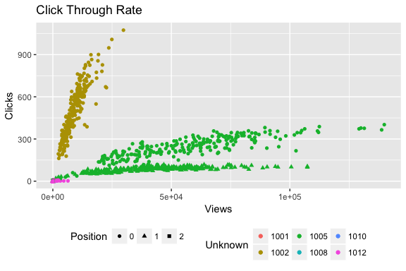
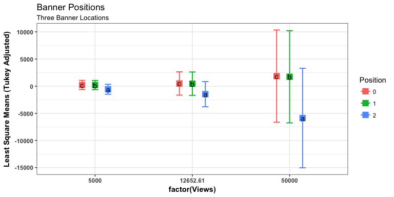

Advertisement Placement in Mobile Applications
================
Chase Baggett

Introduction
============

In 2015, Avazu, an online digital marketing company released 10 days of their data representing marketing compaigns within mobile platforms. It amounts to over 40 million ad views, and associated to that, a click through result of true or false. This data does not come from a conducted experiment, but from the real world, therefore is observational in nature. In addition to that, like the real world, the data is dirty.

It is made more complicated by data anonymization where category descriptions or even names have been hidden from the researchers for reasons of confidentiality. For instance, we are given a cagegorical banner position, but not where that position is, which means we cannot hypothesize from a position of knowledge about the similarity of any positions. We are also given categorical variables they believe are important, with no context. Despite this, it is a valuable insight into the world of online marketing, and the size and reach of the data provides interesting research opportunities.

To put it in context, companies pay to advertise within the platform, and have many options for advertising. The goal of advertising for many companies is to maximize click per view, or click-through-rate. Specifically for this exercise, I intend to try to understand the effect of advertisement position on the click-through rate, after adjustment for other variables.

Data
====

To create a dataset from the raw level clicks and views, I am recording the view and click count of advertiements over the 10 days. The data I am working with is raw web traffic over the 240 hours. Given I have assembled the data from raw clicks we could consider this data simulated, though it is drawn from the real world, I cannot be certain of many aspects of the design and am making some assumptions. I will therefore state this data is simulated in that I constructed the dataset from the raw views and clicks making assumptions about experimental design not provided by the company.

It is a crossed factoral observational study. Every adertisement has an associated position that it was placed within the app. All factor levels are represented within each of the other factor levels randomly. There is no nesting. It is an entirely random design. I am treating all variables as fixed becsause I have no need to generalize beyond the levels of the data. However, we a continuous variavble of importance, and therefore must test the slope to determine in an ANCOVA is needed.

There are a total of four variables in the data.

<table>
<colgroup>
<col width="17%" />
<col width="13%" />
<col width="9%" />
<col width="5%" />
<col width="54%" />
</colgroup>
<thead>
<tr class="header">
<th>Variable</th>
<th>Structure</th>
<th>Type</th>
<th>Lvls</th>
<th>Description</th>
</tr>
</thead>
<tbody>
<tr class="odd">
<td>Clicks</td>
<td>Continuous</td>
<td>Response</td>
<td>NA</td>
<td>The nunber of times the advertisement was clicked.</td>
</tr>
<tr class="even">
<td>Views</td>
<td>Continuous</td>
<td>Fixed</td>
<td>NA</td>
<td>The number of times a given advertisement was viewed.</td>
</tr>
<tr class="odd">
<td>Position</td>
<td>Factor</td>
<td>Fixed</td>
<td>3</td>
<td>The position on the site of the advertisement.</td>
</tr>
<tr class="even">
<td>Unknown</td>
<td>Factor</td>
<td>Fixed</td>
<td>7</td>
<td>An unkown anonymized categorical variable.</td>
</tr>
</tbody>
</table>

Exploring the Data
==================

The purpose of an advertiser is to maximize the numbers of clicks per view, or stated differently, they are trying to increase the slope between Views and Clicks. This lends itself naturally to an ANCOVA model with Views as a continuous predictor. Our primarily point of concern is finding factors that increase the slope between clicks and views, or industry terms, the click-through-rate.

As we can see below, there are some very clear and identifiable linear trends in the data, where slope and intercept both change, suggesting an interaction term will be necessary. For Unknown, Avazu would not tell the researchers what it meant, yet chose to include it in the data anyway. It has been been made entirely anonymous, and we therefore cannot attribute any specific meaning to it. Position represents one of three locations to place an advertisement within the mobile app.



Methods & Tests
===============

All Equal Slopes Equal to Zero
==============================

In order to know which kind of model to fit, we must first test the slope of Click to Views. If we establish the slope is zero, we can use an ANOVA model, but if the slope is non-zero, we must use an ANCOVA model.

For a function of *y* = *β*<sub>0</sub> + *β*<sub>1</sub>*V**i**e**w**s*:

*H*<sub>*o*</sub> : *β*<sub>1</sub> = 0 *H*<sub>*a*</sub> : *β*<sub>1</sub> ≠ 0

As we can see below, with a near zero p-value, we reject the null hypothesis in favor the alternative that the slope is non-zero. This means we must use an ANCOVA model to account for the covariate.

|           |    Df|    Sum.Sq|     Mean.Sq|   F.value|  Pr..F.|
|-----------|-----:|---------:|-----------:|---------:|-------:|
| Views     |     1|   9894694|  9894694.31|  363.2439|       0|
| Residuals |  2066|  56277446|    27239.81|        NA|      NA|

All Slopes Equal by Position
============================

Now, we have established the slope is non-zero, but we have not established that the slopes are different. We must use this to decide to use an equal or different slopes model. For a function of *y* = *β*<sub>0</sub> + *β*<sub>1</sub>*V**i**e**w**s* + *β*<sub>2</sub>*P**o**s**i**t**i**o**n* + *β*<sub>3</sub>*V**i**e**w**s* \* *P**o**s**i**t**i**o**n*:

*H*<sub>*o*</sub> : *β*<sub>3</sub> = 0 *H*<sub>*a*</sub> : *β*<sub>3</sub> ≠ 0

As we can see below, with a near zero p-value, we reject the null hypothesis in favor the alternative that the slope are not equal, and therefore must use a different slopes model.

|                |    Df|      Sum.Sq|     Mean.Sq|    F.value|    Pr..F.|
|----------------|-----:|-----------:|-----------:|----------:|---------:|
| Views          |     1|   9894694.3|  9894694.31|  444.03969|  0.00e+00|
| Position       |     2|   9821046.5|  4910523.24|  220.36731|  0.00e+00|
| Views:Position |     2|    508120.2|   254060.08|   11.40134|  1.19e-05|
| Residuals      |  2062|  45948279.4|    22283.36|         NA|        NA|

Full ANCOVA Model
=================

Now I add Unknown category to the model and test the equal slopes assumption for the Unknown category. For a function of

*y* = *β*<sub>0</sub> + *β*<sub>1</sub>*V**i**e**w**s* + *β*<sub>2</sub>*P**o**s**i**t**i**o**n* + *β*<sub>3</sub>*U**n**k**n**o**w**n* + *β*<sub>4</sub>*V**i**e**w**s* \* *P**o**s**i**t**i**o**n* + *β*<sub>5</sub>*U**n**k**n**o**w**n* \* *V**i**e**w**s*

|                |        Sum.Sq|    Df|      F.value|     Pr..F.|
|----------------|-------------:|-----:|------------:|----------:|
| (Intercept)    |  2.412948e-01|     1|    0.0002007|  0.9886990|
| Views          |  6.330415e+00|     1|    0.0052647|  0.9421649|
| Position       |  5.180047e+04|     2|   21.5398731|  0.0000000|
| Unknown        |  1.205651e+06|     5|  200.5354313|  0.0000000|
| Views:Position |  9.821525e+05|     2|  408.4024562|  0.0000000|
| Views:Unknown  |  4.993376e+06|     5|  830.5459770|  0.0000000|
| Residuals      |  2.467391e+06|  2052|           NA|         NA|

Hypothesis Tests
================

This model has Five Hypothesis Tests.

Test for Intercept
------------------

*H*<sub>0</sub> : *β*<sub>0</sub> = 0 *H*<sub>*a*</sub> : *β*<sub>0</sub> ≠ 0
Outcome: Reject the Null in Favor of the Alternative

``` r
knitr::kable(data.frame(Anova(ancova_model_full,type = "3"))[1,])
```

|             |     Sum.Sq|   Df|    F.value|    Pr..F.|
|-------------|----------:|----:|----------:|---------:|
| (Intercept) |  0.2412948|    1|  0.0002007|  0.988699|

Test For Slope Across Factors
-----------------------------

*H*<sub>0</sub> : *β*<sub>1</sub> = 0 *H*<sub>*a*</sub> : *β*<sub>1</sub> ≠ 0
Outcome: Fail to Reject the Null. We could think of this as no slope between click and views in common across the factors.

``` r
knitr::kable(data.frame(Anova(ancova_model_full,type = "3"))[2,])
```

|       |    Sum.Sq|   Df|    F.value|     Pr..F.|
|-------|---------:|----:|----------:|----------:|
| Views |  6.330415|    1|  0.0052647|  0.9421649|

Test for Position Mean
----------------------

*H*<sub>0</sub> : *μ*<sub>1</sub> = *μ*<sub>2</sub> = *μ*<sub>3</sub> *H*<sub>*a*</sub>: At Least One Inequality Outcome: Reject the null in favor of the alternative.

``` r
knitr::kable(data.frame(Anova(ancova_model_full,type = "3"))[3,])
```

|          |    Sum.Sq|   Df|   F.value|  Pr..F.|
|----------|---------:|----:|---------:|-------:|
| Position |  51800.47|    2|  21.53987|       0|

Test for Unknown Category Mean
------------------------------

*H*<sub>0</sub> : *μ*<sub>1</sub> = *μ*<sub>2</sub> = *μ*<sub>3</sub> = *μ*<sub>4</sub> = *μ*<sub>5</sub> = *μ*<sub>6</sub> = *μ*<sub>7</sub> *H*<sub>*a*</sub>: At Least one Inequality Outcome: Reject the null in favor of the alternative.

``` r
knitr::kable(data.frame(Anova(ancova_model_full,type = "3"))[4,])
```

|         |   Sum.Sq|   Df|   F.value|  Pr..F.|
|---------|--------:|----:|---------:|-------:|
| Unknown |  1205651|    5|  200.5354|       0|

Test for Difference in Slope by Position
----------------------------------------

*H*<sub>0</sub>: All Positions Have the Same Slope With relations to Views. *H*<sub>*a*</sub>: At Least One Inequality amongst the factor levels.

Outcome: Reject the null in favor of the alternative.

``` r
knitr::kable(data.frame(Anova(ancova_model_full,type = "3"))[5,])
```

|                |    Sum.Sq|   Df|   F.value|  Pr..F.|
|----------------|---------:|----:|---------:|-------:|
| Views:Position |  982152.5|    2|  408.4025|       0|

Test for Difference in Slope by Unknown Category
------------------------------------------------

Where *P**o**s**i**t**i**o**n*<sub>1</sub>,*P**o**s**i**t**i**o**n*<sub>2</sub>, and *P**o**s**i**t**i**o**n*<sub>3</sub> are 0/1 variables for category.

*H*<sub>0</sub>: All Positions Have the Same Slope With relations to Views. *H*<sub>*a*</sub>: At Least One Inequality amongst the factor levels.

Outcome: Reject the null in favor of the alternative.

``` r
knitr::kable(data.frame(Anova(ancova_model_full,type = "3"))[6,])
```

|               |   Sum.Sq|   Df|  F.value|  Pr..F.|
|---------------|--------:|----:|--------:|-------:|
| Views:Unknown |  4993376|    5|  830.546|       0|

Mean Comparisons
================

Because I have a covariate and my primary area of interest in the interaction between views and clicks, I am doing a Tukey means comparison at 3 points along the values.

Position
--------



| Position |     Views|        lsmean|           SE|    df|       lower.CL|     upper.CL| .group |
|:---------|---------:|-------------:|------------:|-----:|--------------:|------------:|:-------|
| 2        |    102.00|      8.613105|     6.342798|  2052|      -8.946591|     26.17280| a      |
| 1        |    102.00|     39.876129|     6.475972|  2052|      21.947748|     57.80451| b      |
| 0        |    102.00|     44.258574|     6.022475|  2052|      27.585677|     60.93147| b      |
| 2        |  12210.75|  -1417.228279|   807.753612|  2052|   -3653.450757|    818.99420| a      |
| 1        |  12210.75|    450.962026|   748.423899|  2052|   -1621.009331|   2522.93338| b      |
| 0        |  12210.75|    483.587571|   748.417327|  2052|   -1588.365591|   2555.54073| c      |
| 2        |  68559.25|  -8052.432009|  4539.279864|  2052|  -20619.184444|   4514.32043| a      |
| 1        |  68559.25|   2363.964911|  4204.265798|  2052|   -9275.319080|  14003.24890| b      |
| 0        |  68559.25|   2528.020729|  4204.290867|  2052|   -9111.332664|  14167.37412| c      |
